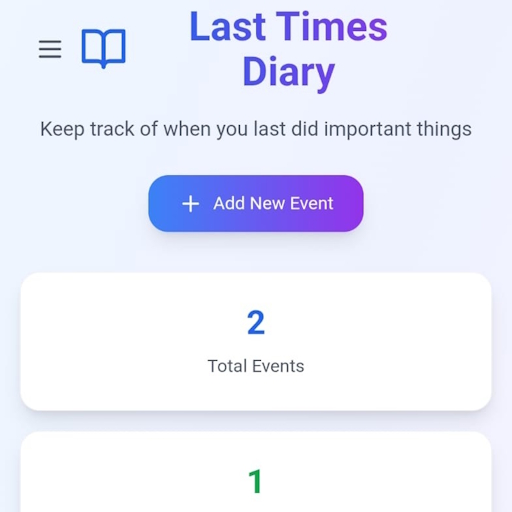

# 📘 Last Times Diary

Ricordati delle cose importanti nella tua vita.

**Last Times Diary** è un'app pensata per aiutarti a tenere traccia dell'ultima volta che hai fatto qualcosa di significativo: chiamato un amico, fatto una passeggiata con i genitori, cucinato qualcosa di speciale… Le piccole cose contano.

---

## ✨ Funzionalità principali

✅ Aggiungi attività importanti che vuoi ricordare  
✅ Visualizza quanti giorni sono passati dall'ultima volta  
✅ Ricevi notifiche quando è passato troppo tempo  
✅ Salvataggio locale sicuro (senza internet o login)  
✅ Interfaccia pulita, veloce e reattiva  
✅ Supporto multilingua 🇮🇹 🇬🇧  
✅ Modalità chiara e scura 🌗  
✅ Nessuna pubblicità o tracciamento

---

## 📱 Scarica l'app

🟢 **Play Store:**  
👉 [Disponibile qui](https://play.google.com/store/apps/details?id=com.ennedev.lastTimesDiary)

📦 **APK / versione di test:**  
👉 [Download da GitHub](https://github.com/Enne18/Last-Times-Diary/releases)

---

## 🧪 Provala e dai feedback!

Se ti va di contribuire:
- Segnala bug o problemi nella sezione [Issues](https://github.com/Enne18/Last-Times-Diary/issues)
- Suggerisci nuove funzionalità!
- Lascia una recensione sul Play Store se ti è piaciuta 😊

---

## 🛠️ Sviluppata con

- React + TypeScript
- Capacitor (per Android)
- WorkManager per notifiche locali
- LocalStorage / Filesystem API
- Java + Kotlin per la parte nativa

---
[comment]: <> (
## 📄 Licenza

Questa app è open source.

---
)
> _Un piccolo promemoria può cambiare una giornata._

